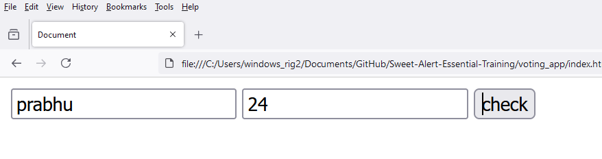

# Voting App
 
1. open `index.html`

```
<!DOCTYPE html>
<html lang="en">
<head>
    <meta charset="UTF-8">
    <meta name="viewport" content="width=device-width, initial-scale=1.0">
    <title>Document</title>

    <script src="https://cdn.jsdelivr.net/npm/sweetalert2@11"></script>

    <script src="main.js"></script>
</head>
<body>

    <input type="text" id="sqrt" placeholder="Enter any integer">

    <input type="button" value="check" id="check_process">
    
</body>
</html>
```

2. open `main.js`

```
window.onload = function()
{
    const name = document.getElementById("name");
    
    const age = document.getElementById("age");
    
    const check_btn = document.getElementById("check_process");

    check_btn.addEventListener('click', function(){

        if (age.value >= 18) 
        {
            Swal.fire({
                icon: 'success',
                title: 'Congrats ' + name.value,
                text: 'You are eligible for voting',
            })    
        }
        else
        {
            Swal.fire({
                icon: 'error',
                title: 'Sorry ' + name.value,
                text: 'You are not eligible for voting',
            })
        }        

    });

}
```




